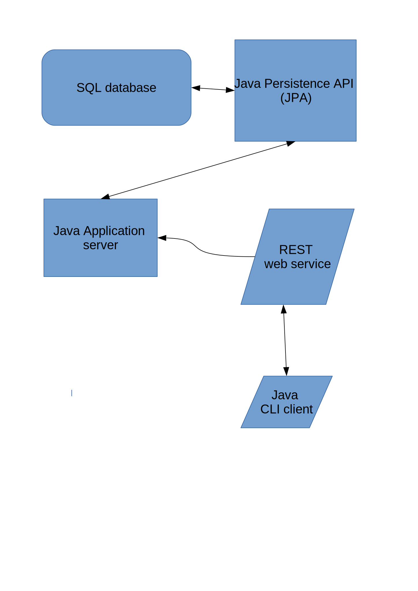

# restpizza 
RestPizza:pizza: - super simple REST-webservice with CRUD-functionality. School assignment

## Features
Complete CRUD-functionality, POST, PUT, GET, DELETE. Returns suitable HTTP-response codes.

* Java 8 Oracle/openJDK
* Java EE 8
* JPA. Functions fine with standard SQL though my setup is a remote MySQL/MariaDB server.


## Building
This is a maven-project. 

Build the war-file using ```mvn package```

This project was meant for a stand-alone application server. Tested and working with Wildfly

## Flow chart
Simple flow chart describing the project.

